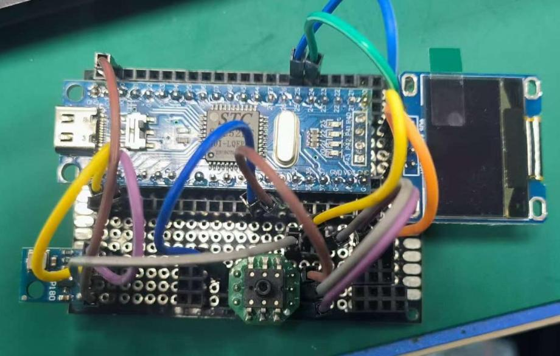
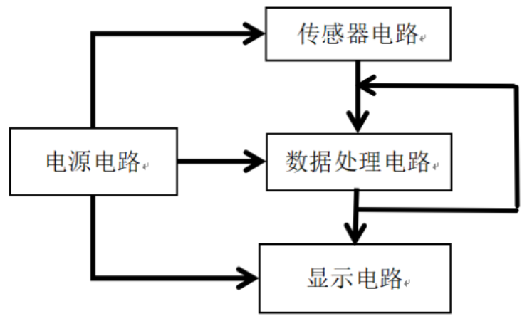
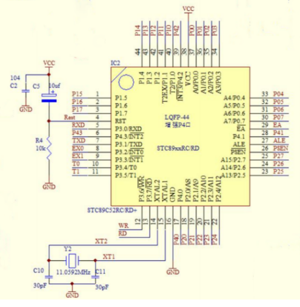
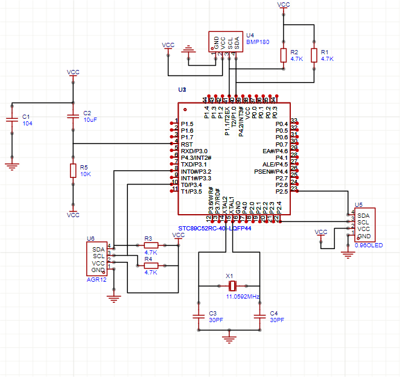
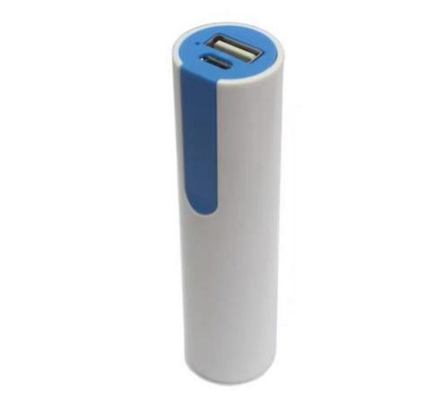
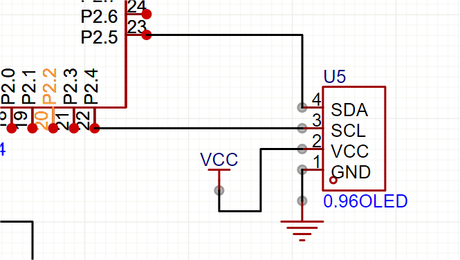
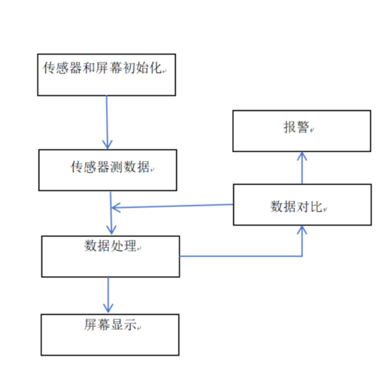
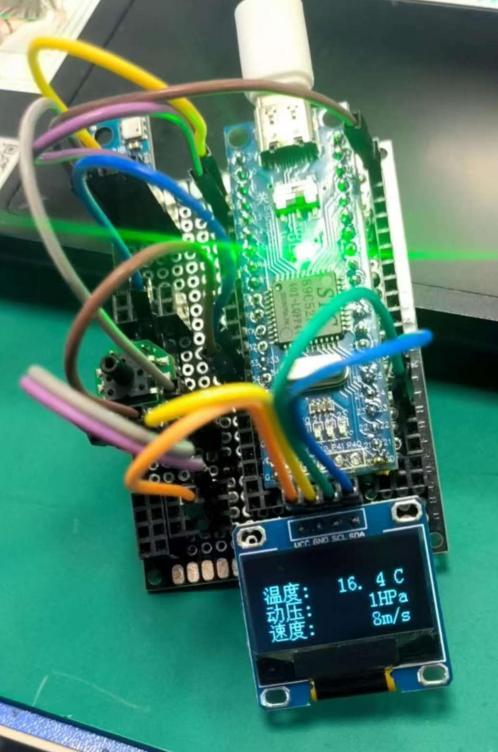

# 电子式飞机气压空速表的设计与开发

> 2025 届毕业设计（物化产品）｜ 湖南·长沙航空职业技术学院 飞机电子设备维修专业
> 学生：胡凯旋 ｜ 指导教师：宋烨

## 一、项目简介

针对飞机空速测量需求，设计并完成一台**电子式飞机气压空速表**的原理样机。通过气压传感器采集动压信号，经单片机进行数据处理与换算，最终由 OLED 屏实时显示空速数值，并在速度异常时触发报警。

整机由**传感器电路、数据处理电路、显示电路、电源电路**四部分构成，已完成元器件选型、电路原理图设计、软件程序编写、实物安装与功能测试的完整流程。

## 二、系统组成

| 电路模块 | 方案选型 | 说明 |
|---|---|---|
| 传感器电路 | **压敏电阻式压力传感器** | 对比压敏电阻与电容式两种方案，选择压敏电阻方案（成本低、电路结构简单），采集气压信号 |
| 数据处理电路 | **STC89C52RC 单片机** | 对比单片机方案与集成芯片方案，选择单片机方案；搭建最小系统（电源、晶振、复位电路） |
| 显示电路 | **0.96 寸 OLED 屏** | 对比 OLED 与数码管方案，选择 OLED（显示清晰、便于后续扩展），I²C 方式与单片机连接 |
| 电源电路 | **锂电池供电** | 经 USB 接口与开关为整机供电，兼顾效率与空间 |

## 三、硬件设计

### 单片机最小系统

包含电源电路、晶振电路与复位电路，为核心控制部分提供稳定运行条件。

### 传感器电路

压力传感器与单片机连接，完成气压信号的采集与数据传输。

### 显示电路

OLED 屏通过 I²C（SDA/SCL）与单片机 I/O 口连接，实现显示控制。

## 四、软件设计

主程序流程：**初始化屏幕与传感器 → 采集气压数据 → 数据换算与处理 → OLED 实时显示 → 数值对比与超限报警**。

程序分为主程序与子程序两级结构：

- **主程序**：完成屏幕与传感器初始化，循环接收并处理气压数据、持续刷新显示
- **传感器子程序**：驱动压力传感器，读取气压数据并传输
- **显示子程序**：初始化显示模块并刷新显示内容

## 五、安装与调试

- **实物安装**：按元器件清单准备物料，依安装注意事项完成整机装配
- **功能调试**：使用**打气桶模拟动压**，测试空速测量与报警功能，验证产品性能
- **输出效果**：OLED 屏稳定显示空速数值，超限时触发报警

## 六、设计成果特点

1. **方案比选过程完整**：传感器、主控、显示、电源四个模块均对比了至少两种方案后择优确定，兼顾精度、成本与电路复杂度
2. **功能集成**：集数据采集、处理、显示与超限报警于一体
3. **模块化设计**：电路按功能模块划分，便于故障定位与后续升级
4. **面向实际应用**：从人机工程学角度选择数字显示方式，便于快速读取信息

## 七、资料索引

| 文件 | 内容 |
|---|---|
| `docs/task-book.pdf` | 毕业设计任务书（课题要求与考核标准） |
| `docs/design-description.pdf` | 毕业设计成果说明（物化产品，含设计思路与实施过程） |
| `docs/thesis.pdf` | 毕业设计论文全文（电子式飞机气压空速表的设计与开发） |

## 八、说明

- 本仓库为**毕业设计资料存档**：包含设计文档与实物照片，硬件实物为原理样机（面包板搭建）。
- 设计工作内容：方案对比与选型、电路原理图设计、程序编写、实物装配与调试测试。
